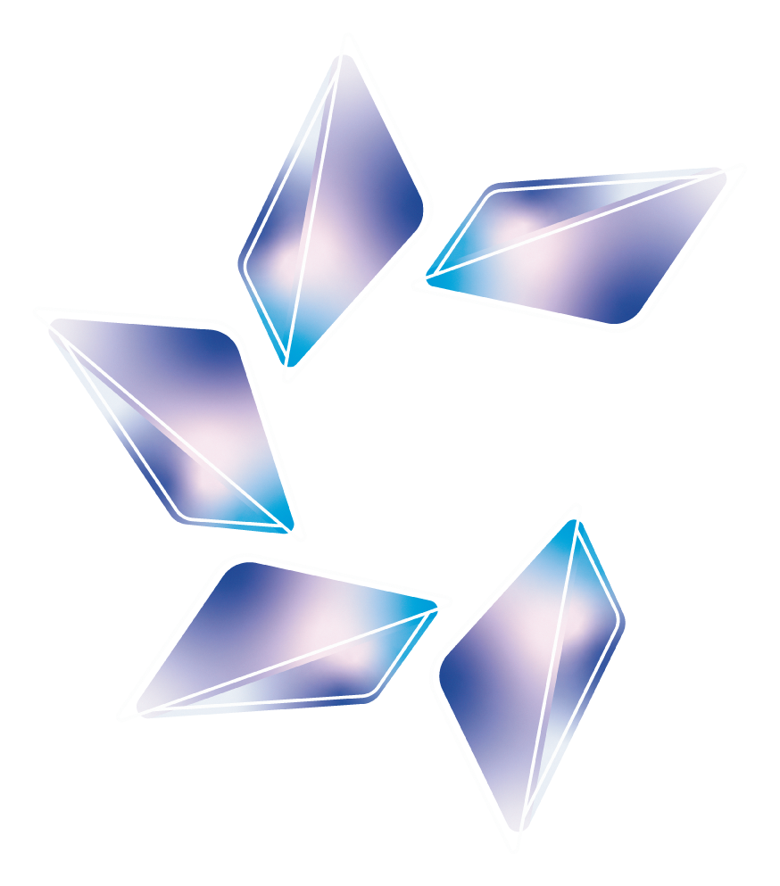
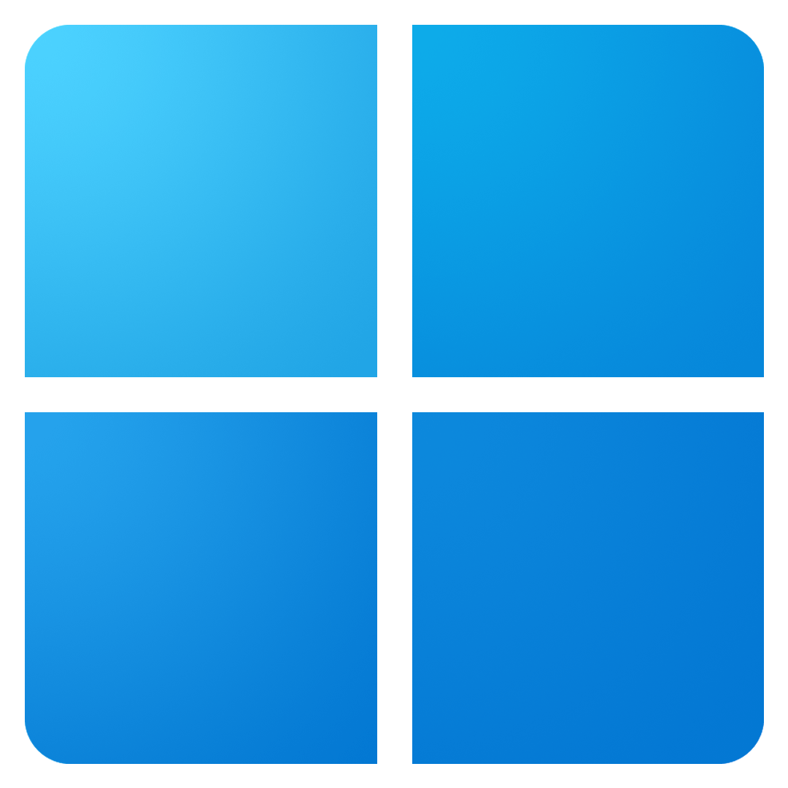
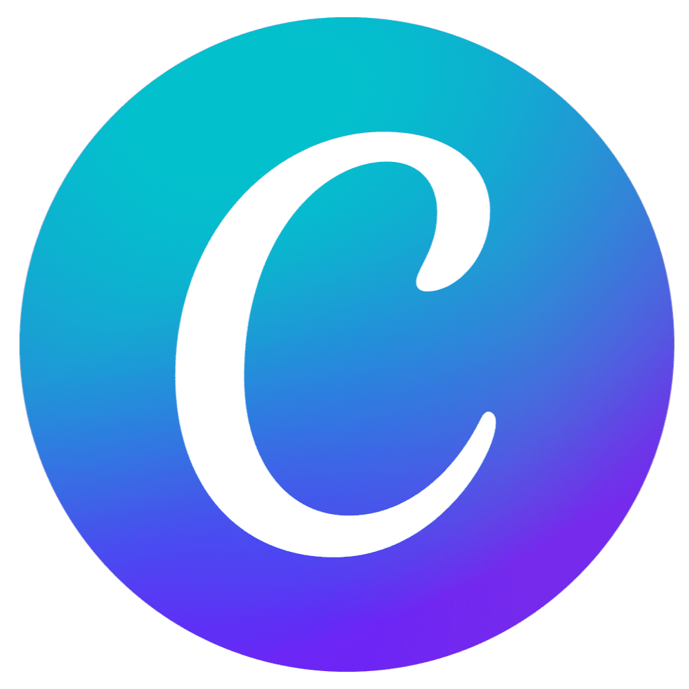
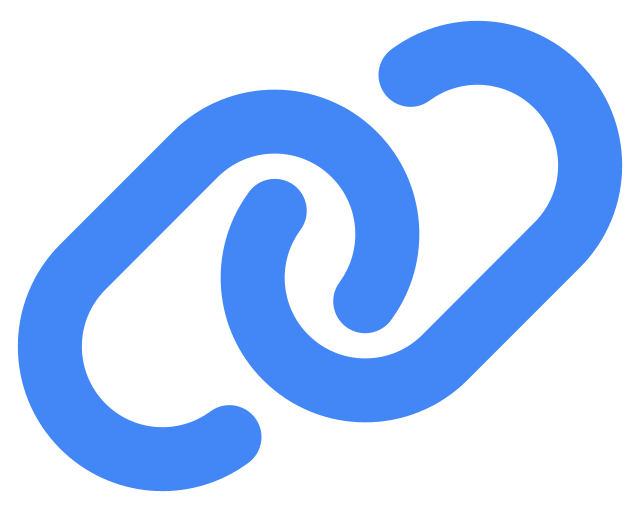

## 👋🏻｜Hello! I’m Erik, a young Programmer!!!
**But you can call me _ErikrafT_**

Welcome to my GitHub profile! I am passionate about technology and exploring the world of software development.
I am excited to collaborate on interesting and challenging projects and to be part of the developer community.

---

## 📋｜About
I am a developer and I am <!--IDADE-->16<!--/IDADE--> years old. When I was 11, in 2021, I created my first website on [Blogger](https://www.blogger.com/).  
In 2022, at the age of 12, I created my second website on [Google Sites](https://sites.google.com/).  
At that time, I did not know that programming languages existed, but over time I learned to use `F12` (Inspect) and `Ctrl+U` (view page source in the browser).  
That is how I discovered that programming languages existed, and today I am <!--IDADE-->16<!--/IDADE--> years old!

---

  
## 🛠️｜Languages & Technologies

| Area                    | Technologies |
| ----------------------- | ------------ |
| ⚙️｜Programming Languages   |      |
| 📚｜Frameworks & Libraries  |    |
| 📂｜Databases               |  |
| 🪛｜Tools & Deployment      |           |
| 🎨｜Design & Productivity   |      |

---

## 📈｜Data and activities

  
  

  
---

## ⚙️｜Some tools I use!!!

👀｜View the tools

- [Cloudflare](https://www.cloudflare.com/)
- [Squarespace Domains](https://domains.squarespace.com/pt/)
- [Render](https://render.com/)
- [Netlify](https://www.netlify.com/)
- [Vercel](https://vercel.com/)
- [Shard Cloud](https://shardcloud.app/)
- [Discloud](https://discloud.com/)
- [YAMLLINT](https://www.yamllint.com/)
- [JScompress](https://jscompress.com/)
- [CSScompress](https://csscompressor.com/)
- [Encycolorpedia](https://encycolorpedia.pt/)
- [Hovercode](https://hovercode.com/)

---

## 📫｜How to find me???

&nbsp;
&nbsp;
&nbsp;
&nbsp;

---

## 📂｜Projects

｜**Website:**
 
 [ErikrafT Drop](https://github.com/erikraft/Drop)

｜**Android application:**
 
 [ErikrafT Drop Android](https://github.com/erikraft/Drop-Android)

🙏 Thank you for everyone’s support :)

---

## 💰｜Support

<a href="https://ko-fi.com/erikraft" target="_blank">

</a

 

Did you like my projects? Consider making a small contribution to help keep them active.

---

---

 
 
